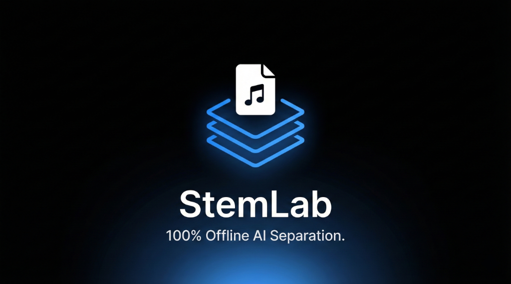

# StemLab v1.0

**Professional-grade AI stem separation. Local. Unlimited.**

StemLab is a powerful, local Windows application for separating audio tracks into individual stems (Vocals, Drums, Bass, Other). It leverages state-of-the-art AI models (Demucs and MDX-Net) to deliver studio-quality results without monthly subscriptions or cloud upload limits.




Demo: https://youtu.be/y9qL7bGh40Y 

Discord: https://discord.gg/2pF8ej5xbt

VirusTotal for Exe: https://www.virustotal.com/gui/file/ffb5e465ced2c8bf6b7c56b6d6450c709caa87c0890baa1dc468a247a971c675?nocache=1

## Features

*   **100% Offline & Local**: No data leaves your machine. Privacy guaranteed.
*   **Unlimited Usage**: No credits, no timers, no subscriptions.
*   **Advanced AI Models**:
    *   **Hybrid Ensemble**: Combines `Demucs` (for instrument separation) and `MDX-Net` (for ultra-clean vocals).
    *   **De-Reverb & De-Echo**: Experimental post-processing to remove room ambiance.
*   **Multiple Stem Modes**:
    *   **2-Stem**: Vocals / Instrumental
    *   **4-Stem**: Vocals, Drums, Bass, Other
    *   **6-Stem**: Vocals, Drums, Bass, Guitar, Piano, Other
    *   **Vocals Only (Ultra Clean)**: Specialized pipeline for the cleanest possible acapellas.
    *   **Instrumental / Karaoke**: High-quality backing tracks.
*   **Professional Workflow**:
    *   **Batch Processing**: Drag & drop multiple files.
    *   **Format Support**: Export as WAV (Lossless) or MP3 (320kbps).
    *   **GPU Acceleration**: Auto-detects NVIDIA GPUs for faster processing. (Testing)
    *   **Smart Queue**: Manage your jobs with progress bars and cancellation.

## Requirements

*   **OS**: Windows 10 or 11 (64-bit)
*   **RAM**: 8GB minimum (16GB recommended)
*   **GPU (Optional)**: NVIDIA GPU with 4GB+ VRAM for accelerated processing. (Runs on CPU if no GPU is found).
*   **Python**: Python 3.10 (for building from source).

## Installation

### Option 1: Pre-built Executable
Purchase the ready-to-run `StemLab.exe` from **[Gumroad](https://justinmurray99.gumroad.com/l/StemLab) or [KoFi](https://ko-fi.com/s/1cbb0a5041)**.
(Instant download, no setup required).

### Option 2: Build from Source

If you want to modify the code or build it yourself, follow these steps:

1.  **Clone the Repository**:
    ```bash
    git clone https://github.com/sunsetsacoustic/StemLab.git
    cd StemLab
    ```

2.  **Install Python 3.10**:
    Ensure you have Python 3.10 installed and added to your PATH.

3.  **Run the Build Script**:
    We provide a robust build script that handles virtual environment creation and dependency installation automatically.

    Double-click **`rebuild_cpu_robust.bat`**.

    This script will:
    *   Create a local virtual environment (`venv_cpu`).
    *   Install all required libraries (`PyQt6`, `torch`, `demucs`, `audio-separator`, etc.).
    *   Package the application into a single `.exe` file using PyInstaller.

4.  **Run the App**:
    *   **Compiled EXE**: Check the `dist` folder for `StemLab.exe`.

## Credits

*   **Demucs** by Meta Research
*   **Audio Separator** (MDX-Net implementation)
*   **PyQt6** for the User Interface

---
*Built with ❤️ by Sunsets Acoustic*
